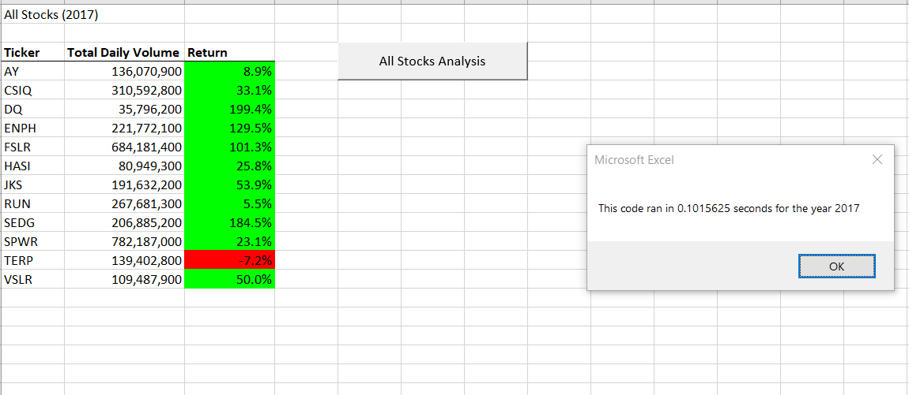
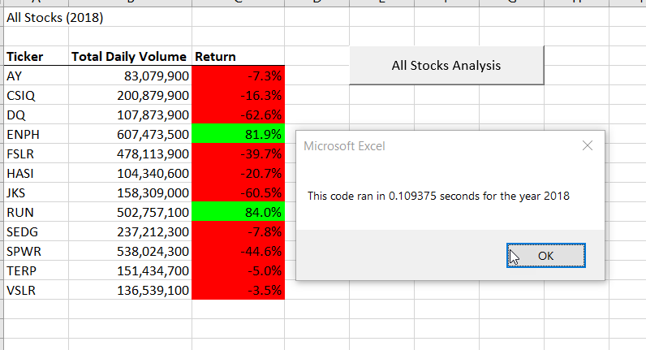
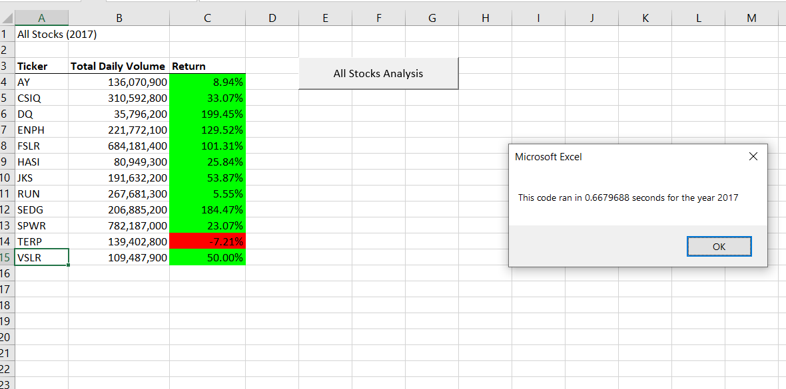
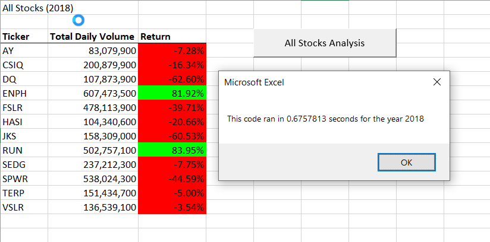

# An anlaysis on Stock Returns & Refactored Code
Performing an analysis on stock returns and improving the code

## Overview of Project
### Purpose
The purpose of this analysis is to examine two sets of data on stock within two years. The first data will look at total volume traded and the second is to compare annual returns on the stock between two years (2017 and 2018). The project uses VBA scripting to create a macro that will run loops through the data to find total volumes traded as well as yearly returns for one of the two years. The second purpose of this project is to refactor the code and compare the new code to the original. The purpose of refactoring the code will be to improve efficiency and make the code better enabled to handle larger amounts of data. 

## Results
### Figure 1: 2017 Results (Refactored)

### Figure 2: 2018 Results (Refactored)

### Results on Stock Performance
When we compare the results on stock performance for the two years, we find that the two years had almost complete opposite stock returns. While the two years saw similar trading volume, the returns on all the stocks for both years were very different. 2017 saw mostly positive returns with only one stock showing a negative return (TERP) while in 2018, all but two stocks (ENPH & RUN) showed negative returns.

### Results on Refactored Code - Improved Run Time
When we compare the newly run code, we find that it has a much faster run time than the original code. In fact, the performance improved by almost 6 times as much! This improvement in efficiency and run time is due to the fact that the new code only has to run through all the data once. In the original code, the vba script/macro had to read and parse once for every ticker which is 12 tickers. However, by using arrays inside the for loops and by eliminating the nested loop, the new code is able to only run through the list once as it puts the data in the appropriate array inside the for loop. A nested loop can slow run time down because it multiplies the number of times it has to parse through things. Eliminating the nested loop and instead having two separate for loops, helps drastically increase the run time. See the original run times below. 

### Figure 3: 2017 Results (Original Code - Slower run time)

### Figure 4: 2018 Results (Original Code - Slower run time)

## Summary
### Advantages & Disadvantages of Refactoring Code
Advantages of refactoring code might be that it can optimize code without changing behavior, it can increase efficiency and thus potentially run time, it can make the code easier for others to understand or be used by other programs/programmers down the line, and it can fix potential bugs and code smells. 
Disadvantages for refactoring code are increased development time, can potentially make the code worse or add more bugs, and stable code that works well and is already efficient really shouldn't be refactored. The biggest potential downside is a loss of time and disrupting already well written code. 
### Pros & Cons
In terms of this specific module, the pros to refactoring the VBA are that we have a much cleaner, efficient, and scalable code that has a much improved run time. This code can now be used to run analysis on thousands of tickers, not jus the original 12. So this refactored code is much more scalable. The disadvantage to refactoring this code is that the code is a little more complex for the basic user, requires a much thorough investigation to make sure we've included all the arrays correctly, and could be more difficult for an entry level programmer to debug. It also took a lot of understanding of which arrays needed to be included and where, and took some time to figure out how to take apart the nested for loop and still make sure we included all relevent volumes, tickers, and starting and ending prices. However in the end, the pros outweigh the cons for this particular macro, because it will become much more scalable at a larger ticker volume level, and so the code is much improved for further use. 

